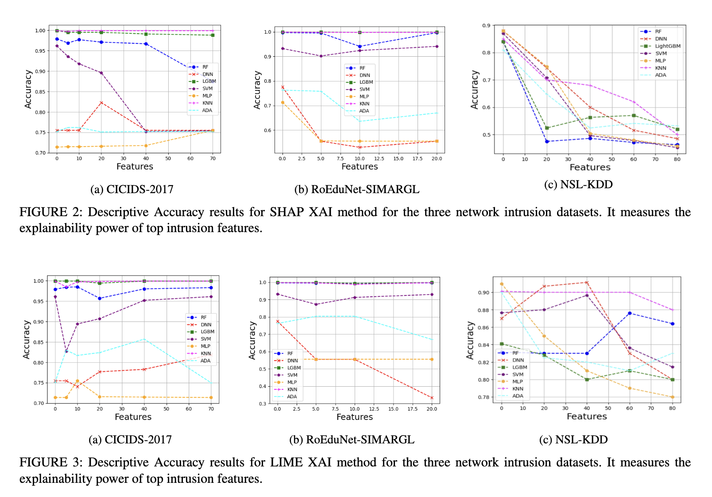
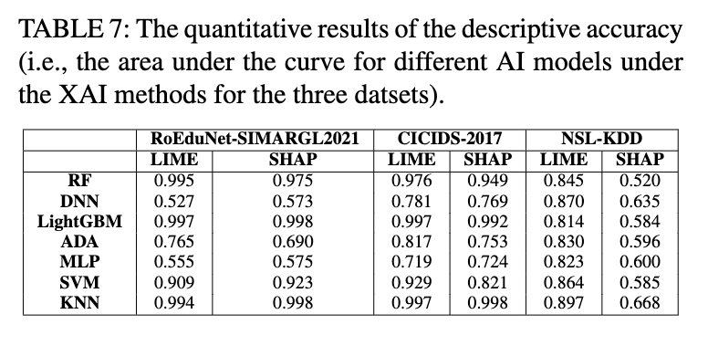
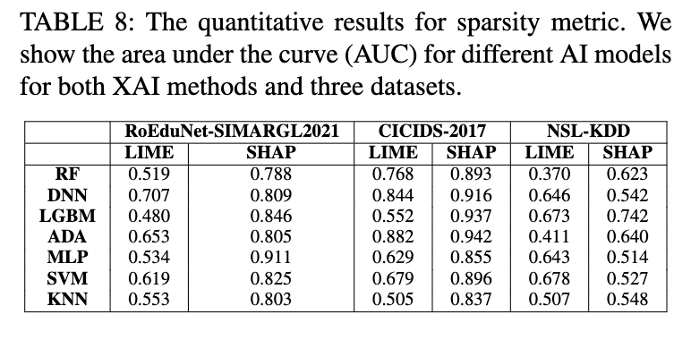
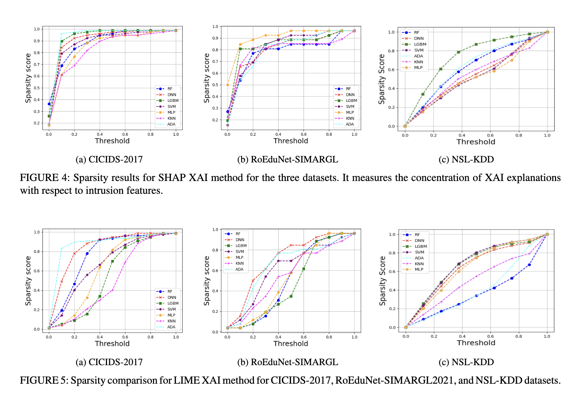

### E-XAI: Evaluating Black-Box Explainable AI Frameworks for Network Intrusion Detection

### Abstract
The escalating frequency of intrusions on networked systems has spurred a wave of innovative research in artificial intelligence (AI) techniques tailored for intrusion detection systems (IDS). The burgeoning need for comprehensible and interpretable AI models is evident among security analysts tasked with overseeing these IDS to ensure the integrity of their networks. Addressing this need, we introduce an all-encompassing framework designed to rigorously evaluate black-box XAI methods applied to network IDS.

Our study encapsulates an examination of both global and local scopes of these enigmatic XAI methods in the realm of network intrusion detection. We meticulously analyze six diverse evaluation metrics, specifically tailored for two renowned black-box XAI techniques, SHAP and LIME. These evaluation metrics are artfully woven, encapsulating essential elements from both network security and AI paradigms.

The robustness and versatility of our XAI evaluation framework is validated through extensive trials involving three prominent network intrusion datasets and seven distinct AI methods, each exuding unique attributes. We wholeheartedly extend an invitation to the network security community, offering unrestricted access to our codes, aspiring to establish a foundational XAI framework for network IDS.

Our empirical findings unveil the intrinsic limitations and unparalleled strengths inherent in contemporary black-box XAI methods when meticulously applied to network IDS, offering invaluable insights and serving as a catalyst for future exploratory endeavors in this domain.

### Key Features
- Comprehensive evaluation of black-box XAI methods for network IDS.
- Detailed analysis using six distinct metrics, offering insights from network security and AI perspectives.
- Extensive evaluations performed on three widely recognized network intrusion datasets.
- Open-source codes made accessible to bolster collaborative efforts and advancements in the field.

### Evaluation Results
1. Prelude - Feature Selection
We initialized our evaluation by assigning importance scores to intrusion features, which were then used in subsequent experiments. Each AI model generated global explanations via SHAP and LIME. During trials for descriptive accuracy and sparsity, we experimented with the removal of top-k features, determining their impact on the model’s performance. Stability was evaluated through repeated trials. Robustness and completeness were assessed on a local level, analyzing individual explanations during integrity attacks and perturbations. The efficiency experiment assessed computational time required for SHAP and LIME under varied scenarios.

2. Descriptive Accuracy
We commenced with the evaluation of the descriptive accuracy of XAI methods on network intrusion datasets. Figures 2-3 (to be inserted by the author) exhibit the descriptive accuracy for SHAP and LIME under three distinct datasets. The insights gained underscore SHAP’s superiority over LIME in terms of global explainability.

Main Insights:
A noticeable drop in accuracy with the removal of features was observed predominantly in NSL-KDD dataset.
SHAP outperformed LIME, as detailed in Table 7.
An anomaly was detected where accuracy remained consistent or increased under top feature removal, raising speculations regarding equal feature contributions or the ‘‘curse of dimensionality’’.

3. Sparsity
The subsequent metric, sparsity, assessed the distribution of feature importance scores. Figures 4-5 (to be inserted by the author) illustrate the sparsity for SHAP and LIME. SHAP again surfaced as the victor, evidencing superior performance in terms of concentrated explanations.

Main Insights:
SHAP's concentration of explanations in fewer intrusion features underscores its low sparsity and elevated explainability.
The AUC curves’ exponential growth shape, especially evident in SHAP’s performance, underscores the concentration of explanation in top features.
LIME, however, exhibited a linear relationship in AUC curves in some cases, indicating a spread of explanation across more features (Table 8).
Summary of Tables and Figures
Table 6 showcases AI models that exhibited a significant accuracy drop, segmented by dataset and XAI method.
Table 7 outlines the quantitative results of descriptive accuracy, providing insights into the nuanced performance of AI models under the scrutinization of XAI methods across varied datasets.
Table 8 provides a quantitative overview of the sparsity metric, illuminating the area under the curve for distinct AI models, XAI methods, and datasets.
Figures 2-3 illustrate the descriptive accuracy of SHAP and LIME XAI methods under the three evaluated network intrusion datasets.
Figures 4-5 depict the sparsity results for both XAI methods, offering a comparative lens to evaluate the concentration of XAI explanations with respect to intrusion features.
Robustness based on: https://github.com/dylan-slack/Fooling-LIME-SHAP/
